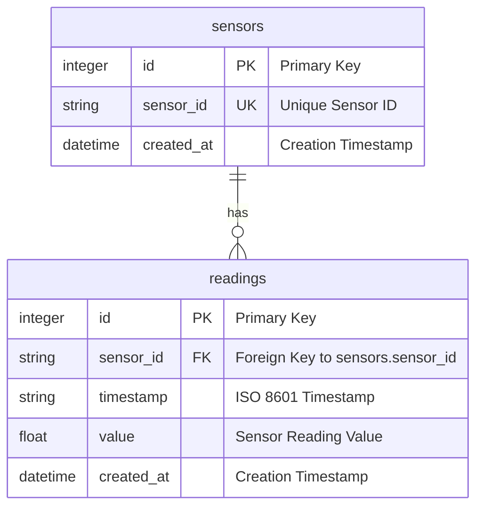
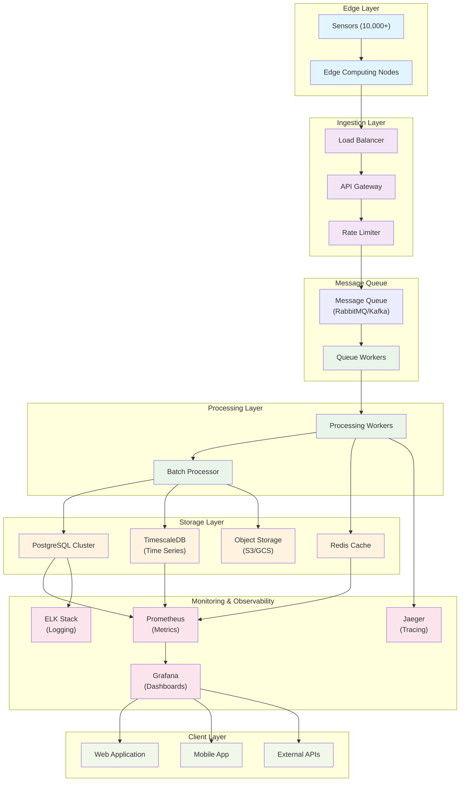

# Environmental Metrics API

A lightweight FastAPI service for collecting and storing environmental sensor data from multiple external sources.

## Overview

This service acts as the main entry point for environmental metrics collected from sensors. It provides a simple REST API for submitting sensor readings and retrieving stored data.

## Features

- **RESTful API**: Clean, well-documented endpoints for sensor data management
- **Async Operations**: Built with FastAPI and aiosqlite for high performance
- **Data Validation**: Comprehensive validation of incoming sensor data
- **Error Handling**: Robust error handling with meaningful error messages
- **SQLite Storage**: Lightweight database suitable for development and small-scale deployments
- **Logging**: Structured logging for monitoring and debugging

## API Endpoints

### Submit Sensor Reading
```
POST /api/v1/readings
```

Accepts a JSON payload containing:
- `sensor_id`: Unique identifier for the sensor (string)
- `timestamp`: ISO 8601 formatted timestamp (string)
- `reading`: Environmental reading value (float)

**Example Request:**
```json
{
    "sensor_id": "sensor-001",
    "timestamp": "2023-12-07T10:30:00Z",
    "reading": 23.5
}
```

**Example Response:**
```json
{
    "message": "Reading submitted successfully",
    "reading_id": 123,
    "sensor_id": "sensor-001"
}
```

### Health Check
```
GET /api/v1/health
```

Returns service health status and current timestamp.

### Get Sensor Readings
```
GET /api/v1/readings/{sensor_id}
```

Retrieves all readings for a specific sensor, ordered by timestamp (newest first).

## Getting Started

### Prerequisites

- Python 3.12+
- pip (Python package installer)

### Installation

1. **Clone the repository:**
   ```bash
   git clone <repository-url>
   cd environmental-metrics-api
   ```

2. **Install dependencies:**
   ```bash
   pip install fastapi uvicorn aiosqlite pydantic
   ```

3. **Run the application:**
   ```bash
   uvicorn main:app --host 0.0.0.0 --port 8000 --reload
   ```

   The `--reload` flag enables auto-reload during development.

### Alternative: Using Poetry

If you prefer using Poetry for dependency management:

1. **Install Poetry:**
   ```bash
   pip install poetry
   ```

2. **Install dependencies:**
   ```bash
   poetry install
   ```

3. **Run the application:**
   ```bash
   poetry run uvicorn main:app --host 0.0.0.0 --port 8000 --reload
   ```

### Testing the API

Once the server is running, you can test it using curl or any HTTP client:

```bash
# Submit a reading
curl -X POST "http://localhost:8000/api/v1/readings" \
     -H "Content-Type: application/json" \
     -d '{
         "sensor_id": "test-sensor",
         "timestamp": "2023-12-07T10:30:00Z",
         "reading": 25.5
     }'

# Check health
curl "http://localhost:8000/api/v1/health"

# Get readings for a sensor
curl "http://localhost:8000/api/v1/readings/test-sensor"
```

### Example API Usage

**Submit a sensor reading:**
```bash
curl -X POST "http://localhost:8000/api/v1/readings" \
     -H "Content-Type: application/json" \
     -d '{
         "sensor_id": "sensor-001",
         "timestamp": "2023-12-07T10:30:00Z",
         "reading": 23.5
     }'
```

**Response:**
```json
{
    "message": "Reading submitted successfully",
    "reading_id": 1,
    "sensor_id": "sensor-001"
}
```

**Get all readings for a sensor:**
```bash
curl "http://localhost:8000/api/v1/readings/sensor-001"
```

**Response:**
```json
[
    {
        "sensor_id": "sensor-001",
        "timestamp": "2023-12-07T10:30:00Z",
        "value": 23.5
    },
    {
        "sensor_id": "sensor-001",
        "timestamp": "2023-12-07T11:30:00Z",
        "value": 24.1
    }
]
```

**Health check:**
```bash
curl "http://localhost:8000/api/v1/health"
```

**Response:**
```json
{
    "status": "healthy",
    "timestamp": "2023-12-07T12:00:00Z"
}
```

## Database Schema

The application uses SQLite with the following schema:

### Current Database Schema



### Sensors Table
```sql
CREATE TABLE sensors (
    id INTEGER PRIMARY KEY AUTOINCREMENT,
    sensor_id TEXT UNIQUE NOT NULL,
    created_at TIMESTAMP DEFAULT CURRENT_TIMESTAMP
);
```

### Readings Table
```sql
CREATE TABLE readings (
    id INTEGER PRIMARY KEY AUTOINCREMENT,
    sensor_id TEXT NOT NULL,
    timestamp TEXT NOT NULL,
    value REAL NOT NULL,
    created_at TIMESTAMP DEFAULT CURRENT_TIMESTAMP,
    FOREIGN KEY (sensor_id) REFERENCES sensors (sensor_id)
);
```

### Indexes
- `idx_readings_sensor_id`: Index on sensor_id for faster queries
- `idx_readings_timestamp`: Index on timestamp for time-based queries

### Schema Details

#### Sensors Table
- **Purpose**: Stores unique sensor identifiers and metadata
- **Key Features**:
  - `sensor_id` is unique and serves as the primary identifier
  - Automatic creation when new sensors submit data
  - Tracks creation timestamp for audit purposes

#### Readings Table
- **Purpose**: Stores all sensor reading data
- **Key Features**:
  - Foreign key relationship to sensors table
  - Stores timestamp and reading value
  - Indexed for efficient querying by sensor_id and timestamp

#### Relationships
- One sensor can have many readings (1:N relationship)
- Readings are linked to sensors via foreign key constraint
- Referential integrity maintained through database constraints

For detailed schema documentation, see [Database Schema Documentation](./schema/database_schema.md).

## Configuration

The application uses environment variables for configuration:

- `DATABASE_URL`: Path to the SQLite database file (default: `sensor_data.db`)

Example:
```bash
export DATABASE_URL="production_sensor_data.db"
uvicorn main:app --host 0.0.0.0 --port 8000
```

## Assumptions Made

1. **Timestamp Format**: All timestamps must be in ISO 8601 format (e.g., "2023-12-07T10:30:00Z")

2. **Sensor Auto-Creation**: Sensors are automatically created when the first reading is submitted for a new sensor ID

3. **Data Retention**: No automatic data cleanup is implemented - data persists indefinitely

4. **Authentication**: No authentication/authorization is implemented for simplicity

5. **CORS**: The API allows requests from all origins (suitable for development)

6. **Error Handling**: The service prioritizes data integrity and will reject invalid readings rather than attempting to correct them

## Scaling Considerations

### Current Architecture (10 sensors, low frequency)

The current implementation uses:
- Single SQLite database file
- Direct aiosqlite connections
- Simple table structure with basic indexing

### Scaling to 10,000+ Sensors (High Frequency)

To scale from 10 sensors to 10,000+ sensors sending data every second, the following architectural changes would be necessary:

#### 1. Database Layer Changes

**Current**: SQLite with direct connections
**Scaled**: PostgreSQL or TimescaleDB with connection pooling

```sql
-- Partitioned table for better performance
CREATE TABLE readings (
    id BIGSERIAL PRIMARY KEY,
    sensor_id VARCHAR(50) NOT NULL,
    timestamp TIMESTAMPTZ NOT NULL,
    value DOUBLE PRECISION NOT NULL,
    created_at TIMESTAMPTZ DEFAULT NOW()
) PARTITION BY RANGE (timestamp);

-- Create monthly partitions
CREATE TABLE readings_2023_12 PARTITION OF readings
    FOR VALUES FROM ('2023-12-01') TO ('2024-01-01');
```

**Benefits**:
- Horizontal partitioning reduces query time
- Connection pooling handles concurrent requests
- Better concurrency support than SQLite

#### 2. Application Architecture Changes

**Current**: Single FastAPI instance
**Scaled**: Microservices with message queuing

```
Sensors → Message Queue (Kafka/RabbitMQ) → Processing Workers → Database
```

**Implementation**:
- Use message queues to decouple ingestion from processing
- Implement worker processes for background data processing
- Add load balancing for multiple API instances

#### 3. Caching Strategy

**Current**: No caching
**Scaled**: Redis for frequently accessed data

```python
# Cache sensor statistics
redis_client.setex(f"sensor_stats:{sensor_id}", 300, json.dumps(stats))
```

**Benefits**:
- Reduce database load for read-heavy operations
- Faster response times for common queries
- Rate limiting and request deduplication

#### 4. Data Ingestion Optimization

**Current**: Individual INSERT statements
**Scaled**: Batch processing and bulk inserts

```python
# Batch insert for better performance
async def batch_insert_readings(readings_batch):
    query = "INSERT INTO readings (sensor_id, timestamp, value) VALUES (?, ?, ?)"
    await db.executemany(query, readings_batch)
```

**Benefits**:
- Reduced database round trips
- Better throughput for high-frequency data
- Lower resource utilization

#### 5. Monitoring and Observability

**Current**: Basic logging
**Scaled**: Comprehensive monitoring stack

- **Metrics**: Prometheus for application metrics
- **Logging**: ELK stack (Elasticsearch, Logstash, Kibana) for log aggregation
- **Tracing**: Jaeger for distributed tracing
- **Alerting**: Grafana with alerting rules

#### 6. Infrastructure Changes

**Current**: Single server deployment
**Scaled**: Containerized deployment with orchestration

```yaml
# Docker Compose for development
version: '3.8'
services:
  api:
    build: .
    environment:
      - DATABASE_URL=postgresql://user:pass@db:5432/sensors
  db:
    image: postgres:15
    environment:
      POSTGRES_DB: sensors
      POSTGRES_USER: user
      POSTGRES_PASSWORD: pass
  redis:
    image: redis:7
```

**Production**: Kubernetes with auto-scaling based on metrics

#### 7. Data Lifecycle Management

**Current**: No data retention policy
**Scaled**: Automated data lifecycle management

- **Hot Data**: Recent data in primary database (last 30 days)
- **Warm Data**: Older data in cheaper storage (last 1 year)
- **Cold Data**: Archived data in object storage (beyond 1 year)

#### 8. Performance Optimizations

**Query Optimization**:
- Use materialized views for aggregated data
- Implement proper indexing strategies
- Consider columnar storage for analytical queries

**Network Optimization**:
- Use compression for data transfer
- Implement connection keep-alive
- Consider edge computing for geographically distributed sensors

### High-Scale System Architecture

For 10,000+ sensors sending data every second, here's the recommended architecture:



#### Architecture Components

**Edge Layer**:
- **Sensors**: 10,000+ distributed sensors sending data every second
- **Edge Computing**: Local processing and data aggregation to reduce network load

**Ingestion Layer**:
- **Load Balancer**: Distributes incoming requests across multiple API instances
- **API Gateway**: Entry point for all sensor data, handles authentication and routing
- **Rate Limiter**: Prevents system overload from high-frequency sensor data

**Message Queue**:
- **RabbitMQ/Kafka**: Decouples data ingestion from processing for better scalability
- **Queue Workers**: Handle message processing and validation

**Processing Layer**:
- **Processing Workers**: Real-time data processing and validation
- **Batch Processor**: Handles bulk data insertion for better performance

**Storage Layer**:
- **Redis**: Caching layer for frequently accessed sensor statistics and rate limiting
- **PostgreSQL**: Primary database with horizontal partitioning for operational data
- **TimescaleDB**: Time-series database optimized for sensor data queries
- **Object Storage**: Long-term storage for historical data and backups

**Monitoring & Observability**:
- **Prometheus**: Metrics collection for system monitoring
- **Grafana**: Visualization dashboards for real-time monitoring
- **Jaeger**: Distributed tracing for performance analysis
- **ELK Stack**: Centralized logging and log analysis

#### Key Scaling Features

**Horizontal Scaling**:
- Multiple API instances behind load balancer
- Database sharding and partitioning
- Distributed caching with Redis clusters
- Message queue clustering for high availability

**Performance Optimizations**:
- Batch processing for database writes
- Caching layer to reduce database load
- Time-series database for efficient time-based queries
- Edge computing to reduce network latency

**Reliability & Fault Tolerance**:
- Message queue ensures data persistence during processing
- Database replication for high availability
- Circuit breakers for graceful degradation
- Health checks and auto-scaling based on metrics

**Data Lifecycle Management**:
- Hot data in primary database (30 days)
- Warm data in cheaper storage (1 year)
- Cold data in object storage (archival)
- Automated data migration between tiers

#### Traffic Flow

1. **Data Ingestion**: Sensors → Edge Computing → Load Balancer → API Gateway
2. **Queue Processing**: API Gateway → Message Queue → Queue Workers
3. **Data Processing**: Queue Workers → Processing Workers → Batch Processor
4. **Storage**: Batch Processor → PostgreSQL/TimescaleDB/Redis
5. **Monitoring**: All components → Prometheus → Grafana
6. **Client Access**: Grafana → Web/Mobile Apps and External APIs

For detailed scaling architecture documentation, see [Scaling Architecture Documentation](./schema/scaling_architecture.md).

## Development

### Running Tests

The project includes unit tests that can be run with:

```bash
python -m pytest tests/ -v
```
