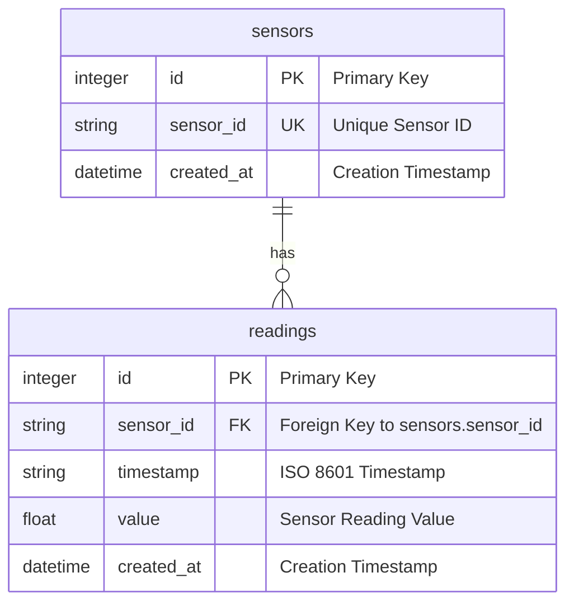

# Database Schema Diagram

## Current SQLite Schema

## Schema Details

### Sensors Table
- **Purpose**: Stores unique sensor identifiers and metadata
- **Key Features**:
  - `sensor_id` is unique and serves as the primary identifier
  - Automatic creation when new sensors submit data
  - Tracks creation timestamp for audit purposes

### Readings Table
- **Purpose**: Stores all sensor reading data
- **Key Features**:
  - Foreign key relationship to sensors table
  - Stores timestamp and reading value
  - Indexed for efficient querying by sensor_id and timestamp

### Indexes
- `idx_readings_sensor_id`: Optimizes queries filtering by sensor
- `idx_readings_timestamp`: Optimizes time-based queries and sorting

## Relationships
- One sensor can have many readings (1:N relationship)
- Readings are linked to sensors via foreign key constraint
- Referential integrity maintained through database constraints