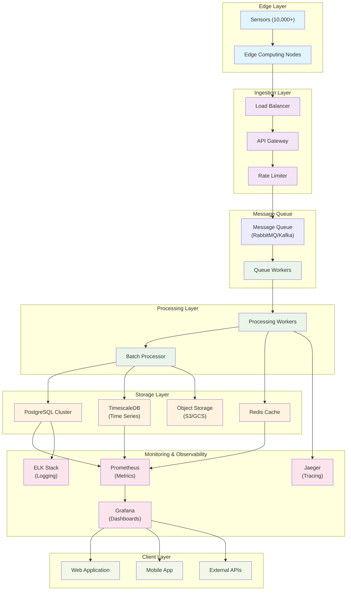

# High-Scale System Architecture

## Scaled Architecture for 10,000+ Sensors

## Architecture Components

### Edge Layer
- **Sensors**: 10,000+ distributed sensors sending data every second
- **Edge Computing**: Local processing and data aggregation to reduce network load

### Ingestion Layer
- **Load Balancer**: Distributes incoming requests across multiple API instances
- **API Gateway**: Entry point for all sensor data, handles authentication and routing
- **Rate Limiter**: Prevents system overload from high-frequency sensor data

### Message Queue
- **RabbitMQ/Kafka**: Decouples data ingestion from processing for better scalability
- **Queue Workers**: Handle message processing and validation

### Processing Layer
- **Processing Workers**: Real-time data processing and validation
- **Batch Processor**: Handles bulk data insertion for better performance

### Storage Layer
- **Redis**: Caching layer for frequently accessed sensor statistics and rate limiting
- **PostgreSQL**: Primary database with horizontal partitioning for operational data
- **TimescaleDB**: Time-series database optimized for sensor data queries
- **Object Storage**: Long-term storage for historical data and backups

### Monitoring & Observability
- **Prometheus**: Metrics collection for system monitoring
- **Grafana**: Visualization dashboards for real-time monitoring
- **Jaeger**: Distributed tracing for performance analysis
- **ELK Stack**: Centralized logging and log analysis

## Key Scaling Features

### Horizontal Scaling
- Multiple API instances behind load balancer
- Database sharding and partitioning
- Distributed caching with Redis clusters
- Message queue clustering for high availability

### Performance Optimizations
- Batch processing for database writes
- Caching layer to reduce database load
- Time-series database for efficient time-based queries
- Edge computing to reduce network latency

### Reliability & Fault Tolerance
- Message queue ensures data persistence during processing
- Database replication for high availability
- Circuit breakers for graceful degradation
- Health checks and auto-scaling based on metrics

### Data Lifecycle Management
- Hot data in primary database (30 days)
- Warm data in cheaper storage (1 year)
- Cold data in object storage (archival)
- Automated data migration between tiers

## Traffic Flow

1. **Data Ingestion**: Sensors → Edge Computing → Load Balancer → API Gateway
2. **Queue Processing**: API Gateway → Message Queue → Queue Workers
3. **Data Processing**: Queue Workers → Processing Workers → Batch Processor
4. **Storage**: Batch Processor → PostgreSQL/TimescaleDB/Redis
5. **Monitoring**: All components → Prometheus → Grafana
6. **Client Access**: Grafana → Web/Mobile Apps and External APIs